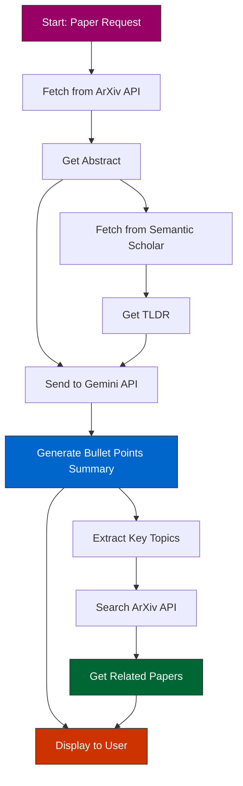

# Research-Gram

A platform for exploring and sharing research paper summaries.

## Overview
Research-Gram is designed to make academic research more accessible and engaging by providing a platform where users can read and interact with research paper summaries.

## System Architecture

## Functional Requirements

### Core Features
- **Research Paper Summaries**
  - Users should be able to read short research paper summaries.
  - Should have infinite scroll where you keep getting more papers as you go.
  - User should be able to like or dislike a paper.
  - Search functionality to find specific papers.
  - Share papers on social media.

### Future Enhancements
*(To be expanded based on additional requirements)*
- **User personalization**
  - User should be able to login and save their preferences
  - User should be recommended new papers based on their previous viewed papers
  - Custom reading lists and collections
  - Email notifications for new papers in followed topics
- **Paper Interactions**
  - Comment section for discussions
  - Follow specific research topics

## System Architecture

### Frontend
- React.js for the user interface

### Backend
- Node.js + Express.js server
- MongoDB database
- Redis for caching

## External APIs

### Content & Search
- [Semantic Scholar API](https://www.semanticscholar.org/product/api/tutorial) for research paper data 
- Arxiv API for fetching research papers
- Gemini API for paper abstract summarization ([example repo](https://github.com/Shaier/arxiv_summarizer))
- Complete paper summarization ([example repo](https://github.com/summarizepaper/summarizepaper/tree/master))

### Social Features
- Twitter API for social sharing

## Getting Started
*(Development setup instructions will be added)*
- Create your Gemini API key from [here](https://aistudio.google.com/app/apikey)

## Contributing
*(Contribution guidelines will be added)*

## License
This project is licensed under the MIT License - see the [LICENSE](LICENSE) file for details.